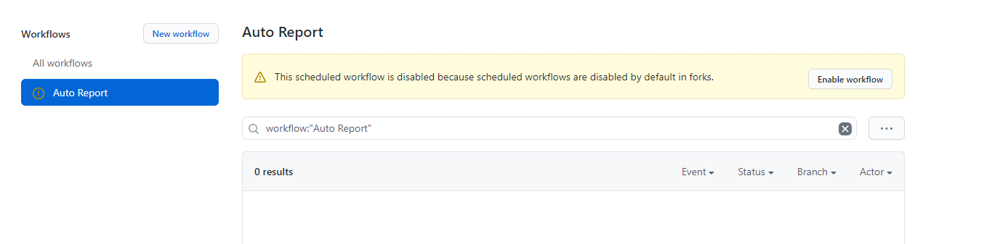

# 上海大学在校生健康之路每日两报自动打卡

程序为python脚本文件，修改配置文件相关信息，设置后台运行脚本，脚本会根据配置文件信息自动进行每日两报。

此版本为精简代码，并加入了一键补报功能。

## 免责申明

本项目仅做免费的学术交流使用。

## 用法

### 1. 你有服务器，只在自己服务器上进行自动打卡

在 `config.yaml` 中设置所有需要打卡的学号密码

**本程序自带一键补报功能**，如需补报，定位到 `main.py` 第12行

```python
NEED_BEFORE = False  # 如需补报则置为True，否则False
START_DT = dt.datetime(2020, 11, 10)  # 需要补报的起始日期
XIAOQU = "宝山"  # 宝山、嘉定或延长
```

针对Ubuntu，编辑定时执行程序cron

```bash
crontab -e
```

加入以下命令：

```bash
# 程序每天8点与20点执行一次，并将结果输出至shu_report.log
# 注意python的路径，main.py与输出日志shu_report.log的绝对路径
0 8,20 * * * python -u /xxx/main.py 2>&1 >> /xxx/shu_report.log
```

如果你服务器是UTC时区，则为

```bash
0 11,23 * * * python -u /xxx/main.py 2>&1 >> /xxx/shu_report.log
```

如果你不确定你服务器的时区，也可以每小时运行一次：

```bash
0 * * * * python -u /xxx/main.py 2>&1 >> /xxx/shu_report.log
```

### 2. 你没有服务器，使用 github actions（推荐）

1. fork 该仓库至你的仓库下
2. 定位到你的仓库的`Settings`的`Secrets`选项卡
3. 添加secret（New repository secret）

`NAME` 设置为 `USERS`
`VALUE` 设置为 `学号1,密码1;学号2,密码2` 的格式，注意逗号与分号的区分，学号密码之间用逗号，每两个学号之间用分号，如果只有一个学号密码则不需要加分号


4. 定位到你仓库下的 `Actions` 选项卡，点击 `Enable workflow`



5. Actions 已经启动完成，每隔一个小时会执行一次，每执行一次会在 `Actions` 选项卡下生成一个报告


## 依赖

- python3
- 依赖：
  - pyyaml
  - beautifulsoup4
  - requests

## 感谢

感谢各位 contributors 所做的贡献。