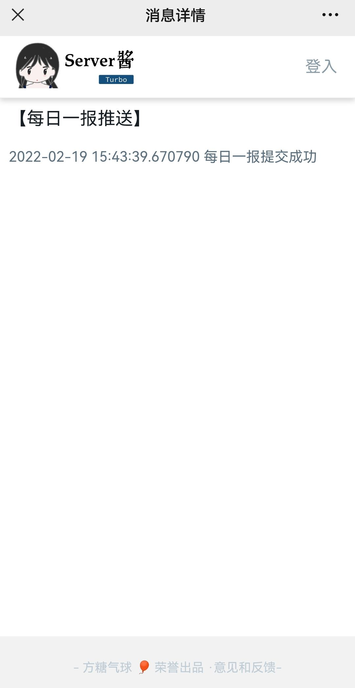

# 上海大学健康之路每日一报/每日两报自动打卡

**使用selenium提交表单（测试中），自动生成行程码（目前发现行程码只需要图片中有日期文字，且图片长宽比与手机差不多就行）**

**适配2022-02-19版，可以使用server酱推送填报信息，secret填写有所改动**

**适配2022-01-15版，增加随申码。请真实提交随申码与行程码。不信谣不传谣！**

**适配2021-11-05版，DangSZS**

**适配2021-11-04版，修复了ShiFSH字段 [issue 51](https://github.com/BlueFisher/SHU-selfreport/issues/51)，去除随申码，丰富日志记录，若出现错误，可以当天真实提交一次，等第二天再观察**

**适配2021-10-08版，获取当天的随申码、行程码。请真实地提交一次随申码、行程码，后续会自动采用之前上传的随申码、行程码**

**适配2021-06-28版，更新github action的自动打卡时间**

**适配2021-04-24版，暂不支持党史知识天天学**

程序为python脚本文件，修改配置文件相关信息，设置后台运行脚本，脚本会根据配置文件信息自动进行每日一报/每日两报。

支持github actions服务器。

支持一键补报功能。

支持每日一报/每日两报。目前在早9晚9各自动填报一次。

为了避免过多的配置，感谢[@Lanszhang131](https://github.com/Lanszhang131/DailyReport_SHU)的思路，**利用前一天的报送信息进行填报，所以如果你真实地提交过一次，那每天会重复填报。由于默认是早9晚9填报，所以如果你想用真实信息的话第一次在晚上9点填报后修改下信息。**

## 免责申明

本项目仅做免费的学术交流使用。

## 用法

### 0. ⭐Star⭐项目😉

如果你想获取最新的更新，记得右上角的`watch`

### 1. 你有服务器，只在自己服务器上进行自动打卡

在 `config.yaml` 中设置所有需要打卡的学号密码，若不使用Server酱进行推送，请将`sendkey`一项值设置为`"no"`

针对Ubuntu，编辑定时执行程序cron

```bash
crontab -e
```

加入以下命令：

```bash
# 程序每天4点执行一次，并将结果输出至shu_report.log
# 注意python的路径，main.py与输出日志shu_report.log的绝对路径
0 4 * * * python -u /xxx/main.py 2>&1 >> /xxx/shu_report.log
```

如果你服务器是UTC时区，则为

```bash
0 20 * * * python -u /xxx/main.py 2>&1 >> /xxx/shu_report.log
```

如果你不确定你服务器的时区，也可以每小时运行一次：

```bash
0 * * * * python -u /xxx/main.py 2>&1 >> /xxx/shu_report.log
```

### 2. 你没有服务器，使用 github actions（推荐）

#### 你第一次Fork

1. fork 该仓库至你的仓库下
2. 定位到你的仓库的`Settings`的`Secrets`选项卡
3. 添加secret（New repository secret）

`NAME` 设置为 `USERS`

`VALUE` 设置为 `学号1,密码1,no;学号2,密码2,no` 的格式，注意逗号与分号的区分，学号密码之间用逗号，每两个学号之间用分号，必须是英文半角符号，如果只有一个学号密码则不需要加分号

`no`为使用Server酱推送Sendkey的占位符，不使用可以无视


4. 定位到你仓库下的 `Actions` 选项卡，点击 `Enable workflow`


5. 此时Actions 已经启动完成，每天上午八点（UTC+8）和晚上八点各执行一次，每执行一次会在 `Actions` 选项卡下生成一个报告。

   如果需要对报送功能进行测试，可以点击 `run workflow` 按钮，立即进行一次运行。

   


#### 你第二次Fork，要更新原先内容

1. 点击 `Fetch upstream`


2. 点击 `Fetch and merge`


## 使用Server酱推送

什么是Server酱？

「Server酱」，英文名「ServerChan」，是一款「手机」和「服务器」、「智能设备」之间的通信软件。 说人话？就是从服务器、路由器等设备上推消息到手机的工具。

### 登录「Server酱」官网

[官网传送门](https://sct.ftqq.com/login)  

### 微信扫码关注后点击继续  


### 选择 SendKey 选项卡，点击复制  

复制保留 Sendkey


将前文对应的`no`，替换为获得的Sendkey即可

### 推送效果如下



## 依赖

- python3
- 依赖：
  - pyyaml
  - beautifulsoup4
  - requests
  - selenium
  - pillow

## 感谢

感谢各位 contributors 所做的贡献。

